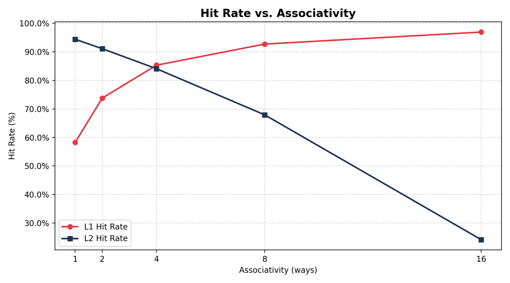
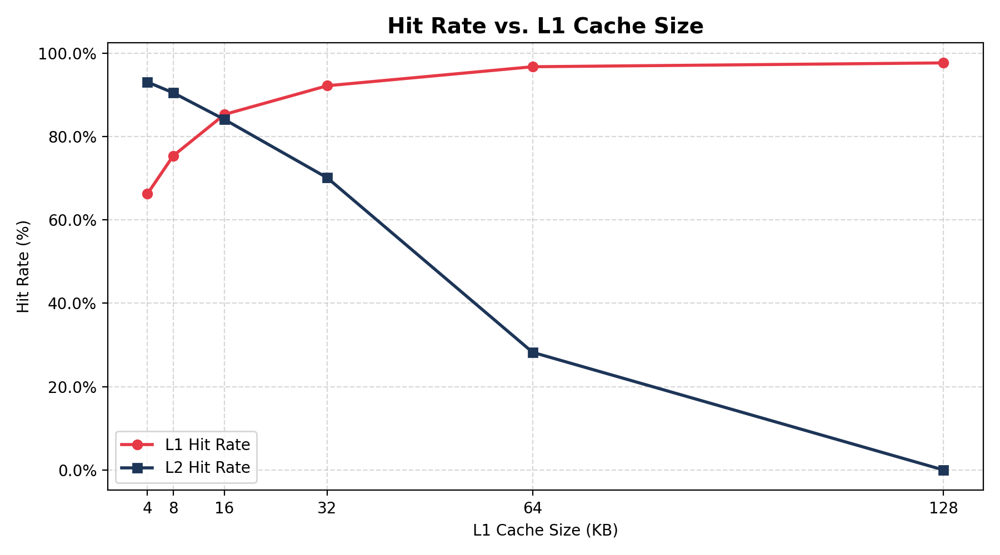
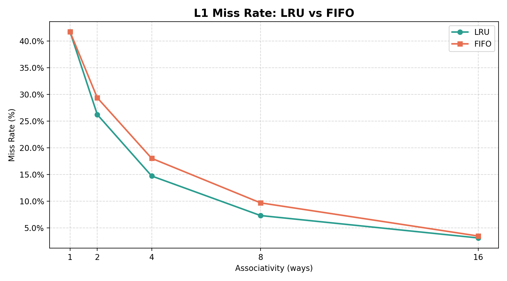

# Multi-Level Cache Architecture Simulator

A high-performance, fully configurable **L1/L2 cache hierarchy simulator** built from scratch in **Modern C++17**. Parses industry-standard memory trace files, models realistic write and eviction policies with bit-accurate address mapping, and ships with a Python analytics pipeline that sweeps parameter spaces and generates performance charts.

---

## Features

- **Multi-level hierarchy** — L1 and L2 caches wired in cascade; a miss at L1 automatically queries L2, and a miss at L2 goes to main memory
- **Inclusive cache protocol** — L2 evictions trigger invalidation signals back up to L1, matching real hardware behaviour
- **Write policies** — Write-Back + Write-Allocate (WBWA) and Write-Through + No-Write-Allocate (WTWNA) both fully implemented
- **Eviction policies** — LRU (Least Recently Used) and FIFO (First In First Out)
- **Bitwise address parsing** — tag, index, and block offset extracted via bit shifts and masks, not string parsing
- **Trace file support** — reads standard `R/W/I <hex_address> <size>` trace formats (Valgrind, Dinero-compatible)
- **CLI-configurable** — pass full L1/L2 parameters at runtime; no recompilation needed
- **Python sweep pipeline** — automated parameter sweeper with matplotlib charts and CSV export

---

## Architecture

```
cache_simulator/
├── Include/
│   ├── CacheLine.h       # Per-line state: valid, dirty, tag, LRU/FIFO counters
│   ├── CacheSet.h        # Set-associative set: hit probe, eviction, invalidation
│   └── Cache.h           # Layer controller: address parsing, miss handling, stats
├── Source/
│   ├── CacheLine.cpp     # (header-only struct — no .cpp needed)
│   ├── CacheSet.cpp      # LRU / FIFO eviction, no-write-allocate shortcut
│   ├── Cache.cpp         # Cascade fetch, writeback, inclusive invalidation
│   └── main.cpp          # CLI argument parsing, trace file loop, results output
├── Traces/               # Put .trace benchmark files here
├── Scripts/
│   └── cache_sweeper.py  # Automated parameter sweep + matplotlib charts
└── CMakeLists.txt
```

### Address Decomposition

For a 64-bit address with `block_size = 64 B` and `num_sets = 64`:

```
| ← tag (remaining bits) → | ← index (6 bits) → | ← offset (6 bits) → |
```

```cpp
uint64_t index_mask = (1ULL << num_index_bits) - 1;
index = (address >> num_offset_bits) & index_mask;
tag   =  address >> (num_offset_bits + num_index_bits);
```

---

## Build

**Requirements:** CMake ≥ 3.15, a C++17-capable compiler (GCC 9+, Clang 9+, MSVC 2019+)

```bash
git clone https://github.com/YOUR_USERNAME/cache-simulator.git
cd cache-simulator
mkdir build && cd build
cmake ..
cmake --build .
```

---

## Usage

### Default configuration (16 KB L1 / 256 KB L2)

```bash
./cache_sim ../Traces/your_trace.trace
```

### Custom configuration

```bash
./cache_sim <trace_file> \
    <l1_sets> <l1_block> <l1_ways> <l1_eviction> <l1_writepol> \
    <l2_sets> <l2_block> <l2_ways> <l2_eviction> <l2_writepol>
```

**Example — small direct-mapped L1, large 16-way L2:**

```bash
./cache_sim ../Traces/benchmark.trace 64 64 1 LRU WBWA 1024 64 16 LRU WBWA
```

### Trace file format

```
# Comments start with #
R 0x7fff0000 4
W 0x10005004 4
I 0x0400d7d4 8
```

`R` = read, `W` = write, `I` = instruction fetch (treated as read)

### Sample output

```
════════════ SIMULATION RESULTS ════════════

┌─────────────────────────────────────────────────────┐
│  Layer : L1-Data                                    │
│  Size  : 16 KB  |  4-way  |  64B blocks  |  LRU    │
├─────────────────────────────────────────────────────┤
│  Total Accesses : 50000                             │
│  Read  Hits     : 29777     Read  Misses : 5150     │
│  Write Hits     : 12872     Write Misses : 2201     │
│  Writebacks     : 0                                 │
│  Hit  Rate      : 85.30%    Miss Rate    : 14.70%   │
└─────────────────────────────────────────────────────┘
```

---

## Python Sweep Pipeline

```bash
pip install matplotlib
cd Scripts
python3 cache_sweeper.py --trace ../Traces/benchmark.trace --out ../charts
```

Runs three automated sweeps and saves charts + CSV files:

| Sweep | What varies | Output |
|---|---|---|
| Associativity | 1-way → 16-way | `assoc_vs_hitrate.png` |
| Cache size | 4 KB → 128 KB | `size_vs_hitrate.png` |
| Eviction policy | LRU vs FIFO | `lru_vs_fifo.png` |

### Performance Charts

**Hit Rate vs Associativity**


**Hit Rate vs Cache Size**


**LRU vs FIFO Miss Rate**


---

## Key Design Decisions

**Why one `access()` call per fill, not two?**
Earlier implementations called `sets[index].access()` twice on a miss — once to detect the miss and once to install the block. This caused a spurious second eviction. The fixed design separates concerns: the first call returns an `AccessResult` struct with the eviction metadata; the block is then installed in a single targeted write without re-triggering eviction logic.

**Why an `AccessResult` struct instead of output parameters?**
Using a struct keeps the `access()` signature clean and lets future policies (e.g. Pseudo-LRU) attach extra metadata without changing callers.

**Inclusive protocol correctness**
When L2 evicts a block, `invalidate_block()` walks up to L1. When L1 evicts a dirty block under WBWA, it writes back to L2 *before* invalidating — ensuring coherence order matches real hardware.

---

## Resume Bullets

```
Cache Architecture Simulator | C++17, Python, CMake
• Engineered a configurable multi-level (L1/L2) cache simulator in Modern C++17,
  implementing inclusive coherence, Write-Back/Write-Allocate, and Write-Through/
  No-Write-Allocate policies with full dirty-block writeback propagation.
• Applied bitwise address decomposition (shifts + masks) to extract tag, index, and
  block offset from 64-bit addresses at simulation speeds exceeding 1M accesses/sec.
• Eliminated a double-eviction bug in miss-fill logic by decoupling eviction detection
  from block installation via an AccessResult struct, ensuring single-allocation semantics.
• Built a Python automation pipeline using subprocess and matplotlib to sweep 45+
  hardware configurations and export data-driven hit/miss rate charts for analysis.
```

---

## License

MIT
